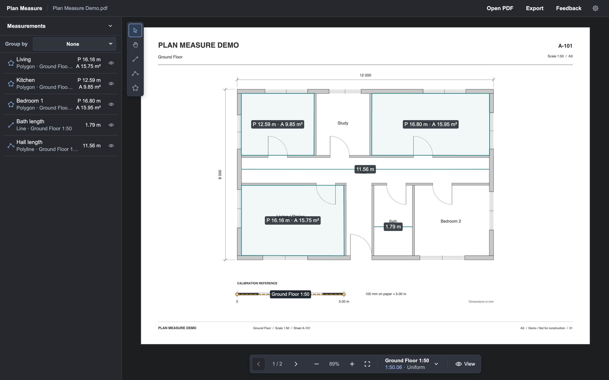

# Plan Measure

Plan Measure measures real-world distances, perimeters, and areas on architectural PDF plans in a desktop browser.

Live app: https://userfypp.github.io/plan-measure/



## Features

- Open PDFs up to 100 MB and work across multiple pages.
- Create multiple named scales per page with Uniform or X/Y calibration in metric, decimal imperial, or feet-and-inches input, plus standard 1:20, 1:50, and 1:100 presets.
- Draw Line, Polyline, and Polygon measurements. Edit vertices or move a whole measurement.
- Use Snap for visible measurement geometry and Ortho for horizontal or vertical segments.
- Manage measurements in the Measurements workspace, including visibility and grouping, and edit properties in Details.
- Create reusable classification dimensions and values, assign them in Organization, and group measurements by a classification dimension.
- Export measurements from every page to CSV with selectable measurement, value, scale, and classification columns.
- Choose System, Light, or Dark appearance and configure measurement display, deletion confirmation, and recovered-plan startup behavior in Settings.

## Privacy

PDF processing happens in the browser. Plan Measure has no account or cloud storage service, and the application code does not send plan or measurement data to a server.

The active PDF and session data are stored locally in IndexedDB for recovery after a reload. Theme, deletion-confirmation, and recovered-plan workspace preferences are stored separately in local storage.

## Using Plan Measure

1. Choose **Open PDF** in the App Bar, or drop a PDF into the empty workspace.
2. Open **Scales** in the Workspace and choose **Add scale**. Use **Uniform** for one reference, **X/Y** for separate horizontal and vertical references, or a standard 1:20, 1:50, or 1:100 ratio. Manual references accept mm, cm, m, decimal inches or feet, and structured feet-and-inches input. Select the active scale from the Viewer Dock.
3. Choose **Line**, **Polyline**, or **Polygon** in the Tool Rail and draw on the plan. Line uses two points, Polyline is open, and Polygon is closed. The Context Toolbar provides **Snap**, **Ortho**, **Finish**, and **Cancel** when they apply.
4. Use **Select** to move a measurement or edit its vertices. The Context Toolbar provides rename, duplicate, **Details**, and delete actions for the selected measurement. Details also supports geometry editing and classification assignment.
5. Use **Classifications** in the Workspace to manage reusable dimensions and values. The **Measurements** workspace can group measurements by a classification dimension.
6. Choose **Export** in the App Bar to select CSV columns and export measurements from every page. Hidden measurements are still exported.

The active scale applies only to new measurements. Existing measurements keep the scale they were created with. Renaming a scale changes only its name. Recalibrating it or editing its reference points updates measurements linked to that scale; Plan Measure asks for confirmation first when the scale is already in use.

**View** in the Viewer Dock controls display units, Polygon area display, and the visibility of labels, measurement geometry, and scale references. Lengths can use mm, cm, m, decimal inches, decimal feet, or feet-and-inches notation. Polygon area can follow the selected linear unit or display acres. Line and Polyline report length; Polygon reports perimeter and area. **Settings** controls appearance, measurement decimal places from 0 to 6, deletion confirmation, and the recovered-plan workspace. System appearance follows the operating system, and deletion confirmation is on by default. The recovered-plan workspace can be **Scales**, **Measurements**, or **Classifications** and defaults to **Scales**. It applies only to recovered sessions; new PDFs always open **Scales**. Decimal places affect displayed decimal measurement values, not feet-and-inches fraction precision or CSV precision.

## Shortcuts

| Shortcut               | Action                                                                   |
| ---------------------- | ------------------------------------------------------------------------ |
| `V`                    | Select                                                                   |
| `H`                    | Hand                                                                     |
| `L`                    | Line                                                                     |
| `M`                    | Polyline                                                                 |
| `P`                    | Polygon                                                                  |
| `O`                    | Toggle Ortho                                                             |
| `S`                    | Toggle Snap                                                              |
| `Enter`                | Finish a valid Polyline or Polygon; leave an idle drawing tool           |
| `Escape`               | Cancel the current drawing or scale workflow; leave an idle drawing tool |
| `Space`                | Temporarily pan while the Viewer has focus                               |
| `+` / `=`              | Zoom in                                                                  |
| `-`                    | Zoom out                                                                 |
| `Cmd/Ctrl+C`           | Copy the selected measurement                                            |
| `Cmd/Ctrl+V`           | Paste a copied measurement                                               |
| `Delete` / `Backspace` | Delete the selected measurement                                          |

Viewer shortcuts do not replace normal text editing or dialog controls.

## Local development

Requirements:

- Node.js 24
- npm

Install dependencies and start Vite:

```bash
npm ci
npm run dev
```

Run the checks before opening a pull request:

```bash
npm run lint
npm test
npm run build
```

Use `npm run format` when formatting is part of the change.

## Architecture

Plan Measure uses React, TypeScript, Vite, PDF.js, Konva, and CSS Modules. Measurement and calibration geometry is stored in PDF page coordinates, so viewer zoom and pan do not change saved geometry.

Persistent session data is kept separate from temporary interaction state.

## Persistence

Plan Measure keeps one recoverable local session. The active PDF and versioned session metadata are stored as separate IndexedDB records. Completed changes are autosaved, with pending changes flushed when the tab is hidden or the page exits when possible. Drawing drafts, Snap, Ortho, zoom, and pan are not persisted.

On startup, a saved session can be continued or discarded. Opening another PDF replaces the saved session after confirmation. If IndexedDB is unavailable or autosave fails, the current tab can keep working but reload recovery is unavailable.

The current session schema is V10. Recovery accepts V1 through V10 sessions and migrates older data to the current schema when possible. If historical data needs repair, it can be opened for repair, but autosave remains paused until the session is valid again.

## Testing

Tests use Vitest. GitHub Actions runs lint, tests, and a production build for pull requests and pushes to `main`.

## Limitations

- Precision drawing and geometry editing require a fine pointer and at least 480 × 360 px of unobscured Viewer space.
- Password-protected PDFs are not supported.
- Linear units are limited to mm, cm, m, in, and ft. Feet-and-inches is a display/input format, and acres are available only for Polygon area.
- X/Y calibration handles different horizontal and vertical scale factors. It does not correct skew, perspective, local distortion, or nonlinear warping.
- Only one recoverable local session is retained. There is no project library, account, cloud sync, or collaboration.
- There is no undo/redo history.
- CSV is the only export format. Measurements are not written back into the PDF.
