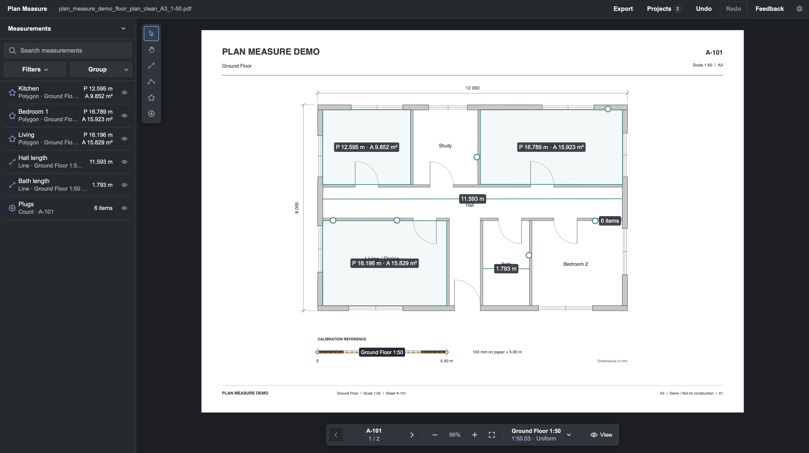

# Plan Measure

Plan Measure measures real-world distances, perimeters, and areas on architectural PDF plans in a desktop browser.

[Open Plan Measure](https://userfypp.github.io/plan-measure/)



## Features

- Work with multi-page PDFs and save multiple projects locally.
- Create named scales per page using reference distances, separate X/Y calibration, or a known 1:n ratio. Copy scales between pages.
- Draw and edit Line, Polyline, and Polygon measurements with Snap and Ortho; duplicate or copy/paste measurements; undo and redo edits.
- Add measurement notes and organize measurements with reusable classifications and nested groups.
- Review project-wide length, perimeter, and area totals in Takeoff, with breakdowns by page, measurement type, or classification.
- Customize page labels, display units, annotation visibility, decimal places, and appearance.
- Export configurable CSV data, XLSX or ODS spreadsheets, complete JSON data, annotated PDFs, or portable `.planmeasure` projects.

## Quick start

1. Choose **Open PDF** in the top bar, or drop a PDF into the empty workspace.
2. In **Scales**, choose **Add scale → Uniform**, mark the endpoints of a known distance on the plan, and enter its real-world length. If you already know the plan's scale, use **Custom ratio** or a standard ratio instead.
3. Choose **Line**, **Polyline**, or **Polygon** from the tool rail and click to place points. A Line finishes after two points; use **Finish** or `Enter` to complete a Polyline or Polygon.
4. Choose **Select** to inspect or edit a measurement. Open **Details** to rename it, add a note, or assign classifications.
5. Open **Takeoff** from the workspace menu to review totals, or choose **Export** in the top bar to download results.

Use the menu at the top of the workspace panel to switch between **Scales**, **Measurements**, **Classifications**, and **Takeoff**. The controls below the plan handle pages, zoom, the active scale, and **View** options.

## Scales

Each page can have multiple named scales. Choose **Add scale** in **Scales**:

- **Uniform**: mark one reference distance and enter its real-world length.
- **X/Y**: mark separate horizontal and vertical references and enter each real-world distance along its axis when the plan has different scale factors along the two axes. New or edited references allow a small placement deviation (at most 10% of the span along the intended axis); more diagonal references are rejected. Existing saved scales retain their results.
- **Custom ratio**: enter the denominator of a known 1:n scale.
- **Standard ratios**: choose 1:20, 1:50, or 1:100.

Reference distances accept mm, cm, m, decimal inches or feet, and feet-and-inches input. Choose the active scale below the plan before drawing.

New measurements use the active scale; existing ones keep their original scale. Expand a scale to rename it, set its ratio, recalibrate it, or edit its reference points. Calibration changes update linked measurements, with confirmation when the scale is in use. Renaming a scale leaves its calibration unchanged.

To reuse a scale, choose its copy button in **Scales**, switch to another page, and choose **Apply copied scale** below the plan. The copied scale is independent of the original.

## Measurements and organization

**Line** measures length between two points. **Polyline** measures length along an open path. **Polygon** measures the perimeter and area of a closed shape.

While drawing, use **Snap** to align points with visible measurement geometry and **Ortho** to constrain segments horizontally or vertically. **Cancel** or `Escape` discards the current drawing.

With **Select**, move a measurement or drag its vertices to edit its geometry. Use the toolbar above the plan to rename, duplicate, inspect, or delete the selection. Copy and paste with the shortcuts below.

Open **Details** to review results and the scale, rename the measurement, or add a note with **Save note**. Assign classification values under **Organization**.

Create classification dimensions and values in **Classifications**. For example, a **Trade** dimension can contain **Electrical** and **Plumbing** values. Dimensions and values can be renamed, archived, and restored; archived entries keep their existing assignments. Choose **Delete** from an entry’s actions menu to remove it and its assignments throughout the project. Deleting a dimension also removes all its values. Use **Undo** to restore a deleted entry and its assignments. Confirmation is enabled by default; **Don’t ask again** turns it off for that entry type, and **Settings** lets you enable it again.

Open **Templates** in **Classifications** to save the active project dimensions and values as a named template. Templates stay in this browser and can be applied to other projects. Expand a saved template to preview its contents. **Apply to project** adds missing entries and reuses matching names without changing measurement assignments; restore matching archived entries first. Applying a template is one undoable edit. Deleting a saved template does not remove classifications already applied to a project.

**Measurements** lists measurements on the current page. Choose one or more classification dimensions in order to create nested groups. Collapse groups or use measurement and group visibility controls to show or hide geometry.

**Takeoff** totals measurements across all pages, including hidden measurements. Length totals cover Lines and Polylines; perimeter and area totals cover Polygons. Choose a **Breakdown** by page, type, or classification dimension. Measurements that cannot be calculated are excluded with a notice.

In **Select** mode, Shift/Ctrl/Cmd-click measurements on the plan or in the Measurements list to add or remove them from the selection. A normal click selects one measurement. The list supports selections across pages; filters do not clear the selection. Use the context bar above the plan to classify or delete selected measurements, use the eye button when multiple measurements are selected to hide them all or show them all if any are hidden, or clear the selection. Classification fields show **Mixed values** when assignments differ; choosing a value applies it to all selected measurements, and **Unclassified** removes that dimension. Each bulk action can be undone in one step. Move, duplicate, or copy a selection from one page as a group, preserving its arrangement. Drag any selected measurement to move the whole group; Escape cancels the move. Vertex editing remains available for single selections. Copy/paste also supports another page when the entire geometry fits, using that page’s active scale. Selections spanning pages cannot be moved, copied, or duplicated together.

Use **Undo** and **Redo** in the top bar or their shortcuts for measurement, scale, classification, and page-label edits. History holds up to 100 edits and resets when you open a project or reload the app. Editing after undo clears redo history. Navigation and display settings are excluded.

## View and settings

The controls below the plan let you change pages, zoom, or **Fit** the page to the viewer. Use the mouse wheel to zoom and **Hand** or hold `Space` to pan. Click the page label to set a custom label or restore the PDF's label.

**View** controls:

- **Display unit**: mm, cm, m, decimal inches, decimal feet, or feet-and-inches notation.
- **Polygon area**: follow the selected linear unit or display acres.
- **Labels**, **Measurements**, and **Calibration**: show or hide calculated labels, measurement geometry, and scale references.

**Settings** controls System, Light, or Dark appearance, measurement decimal places from 0 to 6, independent confirmation settings before deleting measurements, values, and dimensions, and the workspace shown when reopening a saved plan. Decimal places affect displayed decimal values, not feet-and-inches fraction precision or CSV precision. New PDFs open in **Scales**.

## Projects and local storage

Projects are autosaved on this device. Choose **Projects** in the top bar to continue or open a saved project, export it, import a project file, or discard a project after confirmation. Opening another PDF or importing a project creates a new local project and keeps existing saved projects.

Export a `.planmeasure` file to back up the PDF and working data or transfer them to another device.

Plan Measure processes PDFs in your browser and does not send plans or measurements to a server. PDFs and projects stay in IndexedDB; appearance, deletion-confirmation, and startup workspace preferences stay in local storage.

Completed edits are autosaved. Pending saves run when the tab is hidden or closed, when possible. Drafts, Snap, Ortho, zoom, pan, and undo/redo history are not saved. Clearing browser site data removes saved projects; keep `.planmeasure` backups.

If autosave fails, choose **Retry saving** to try again or **Export project** to keep your edits in a `.planmeasure` file. If another tab changed the saved project, export your edits and choose **Reload saved projects** to recover the saved version; reloading requires confirmation because it discards unsaved edits. Older saved data is migrated when possible; if it requires repair, autosave stays paused until the reported problems are resolved.

## Export

Choose **Export** in the top bar:

- **CSV → Measurements** exports measurements from every page, including hidden ones.
- **CSV → Classification assignments** exports one row per assigned classification. Use `measurement_id` to relate assignments to the Measurements CSV.
- **Excel workbook (.xlsx)** and **OpenDocument spreadsheet (.ods)** export both datasets as separate sheets in one file. Quantities are numeric cells; names, notes and identifiers are text.
- **JSON data** exports all pages, measurements, geometry, scales and classifications without embedding the PDF. It includes hidden measurements and archived classifications, independently of column preferences and display units. See the [versioned JSON contract](docs/export-json.md).
- **Annotated PDF** exports the original pages with currently visible measurement geometry. Hidden measurements are omitted, and value labels follow the **Labels** setting. The source PDF is unchanged.

For CSV measurements and spreadsheets, choose columns in the tabbed options panel or apply **Defaults**, **All columns**, or **Required only**. Required columns stay enabled; classification columns and additional calibration or audit fields are organized into separate tabs. Successful exports remember the selected measurement columns.

Spreadsheet exports reject unsupported cell text or data exceeding row, column or text-length limits instead of silently truncating it. Spreadsheet applications may limit numeric precision; Excel retains 15 significant digits. Use JSON when you need the original numeric representation for processing.

For an editable backup that includes the PDF, use **Projects → Export** instead.

## Keyboard shortcuts

Use `Cmd` on macOS and `Ctrl` on Windows or Linux.

| Shortcut               | Action                                                                   |
| ---------------------- | ------------------------------------------------------------------------ |
| `V`                    | Select                                                                   |
| `H`                    | Hand                                                                     |
| `L`                    | Line                                                                     |
| `M`                    | Polyline                                                                 |
| `P`                    | Polygon                                                                  |
| `O`                    | Toggle Ortho                                                             |
| `S`                    | Toggle Snap                                                              |
| `Enter`                | Finish a valid Polyline or Polygon; leave an idle drawing tool           |
| `Escape`               | Cancel the current drawing or scale workflow; leave an idle drawing tool |
| Hold `Space`           | Temporarily pan                                                          |
| `+` / `=`              | Zoom in                                                                  |
| `-`                    | Zoom out                                                                 |
| `Cmd/Ctrl+Z`           | Undo                                                                     |
| `Cmd/Ctrl+Shift+Z`     | Redo                                                                     |
| `Cmd/Ctrl+C`           | Copy the selected measurements                                           |
| `Cmd/Ctrl+V`           | Paste the copied measurements                                            |
| `Delete` / `Backspace` | Delete the selected measurements                                         |

Shortcuts work outside text fields and dialogs. Native control actions keep their usual keys.

## Limitations

- PDFs must be no larger than 100 MB; password-protected PDFs are not supported.
- Precision drawing and geometry editing require a fine pointer and at least 480 × 360 px of unobscured viewer space.
- X/Y calibration handles different horizontal and vertical scale factors. It does not correct skew, perspective, local distortion, or nonlinear warping.
- Projects are saved in this browser on this device, with no cloud sync or collaboration.

## Local development

Requirements: Node.js 24 and npm.

Install dependencies and start Vite:

```bash
npm ci
npm run dev
```

Run the checks before opening a pull request:

```bash
npm run lint
npm test
npm run build
git diff --check
```

Tests use Vitest. GitHub Actions runs lint, tests, and a production build for pull requests and pushes to `main`. See [CONTRIBUTING.md](CONTRIBUTING.md) for contribution guidelines.

## Architecture

Plan Measure uses React, TypeScript, Vite, PDF.js, Konva, and CSS Modules. Measurement and calibration geometry is stored in PDF page coordinates, so viewer zoom and pan do not change saved geometry. Persistent project data is kept separate from temporary interaction state.
