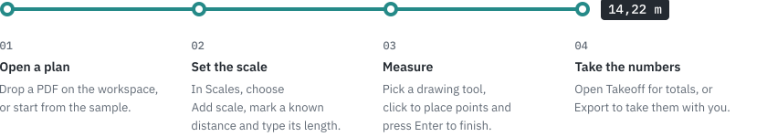

<div align="center">
  <p>
    <a href="https://userfypp.github.io/plan-measure/">
      <picture>
        <source media="(prefers-color-scheme: dark) and (max-width: 600px)" srcset="assets/readme/hero-narrow-dark.svg">
        <source media="(max-width: 600px)" srcset="assets/readme/hero-narrow-light.svg">
        <source media="(prefers-color-scheme: dark)" srcset="assets/readme/hero-wide-dark.svg">
        
      </picture>
    </a>
  </p>
  <p><a href="https://userfypp.github.io/plan-measure/"><picture><source media="(prefers-color-scheme: dark)" srcset="assets/readme/button-open-dark.svg"></picture></a><a href="https://userfypp.github.io/plan-measure/?sample=1"><picture><source media="(prefers-color-scheme: dark)" srcset="assets/readme/button-sample-dark.svg"></picture></a></p>
</div>


Drop in a PDF, set the scale once, and measure lengths, perimeters, areas and counts directly on the drawing. Totals add up across every page and leave as the spreadsheet or annotated PDF you already work with.

There is no account, no upload and no subscription. Plans never leave your device, projects save themselves, and once installed the app keeps working offline. It is free and MIT licensed.

<h3 id="what-you-can-do"><picture><source media="(prefers-color-scheme: dark)" srcset="assets/readme/section-features-dark.svg"></picture></h3>

<p>
  <picture>
    <source media="(prefers-color-scheme: dark) and (max-width: 600px)" srcset="assets/readme/features-narrow-dark.svg">
    <source media="(max-width: 600px)" srcset="assets/readme/features-narrow-light.svg">
    <source media="(prefers-color-scheme: dark)" srcset="assets/readme/features-wide-dark.svg">
    
  </picture>
</p>

<h3 id="quick-start"><picture><source media="(prefers-color-scheme: dark)" srcset="assets/readme/section-start-dark.svg"></picture></h3>

<p>
  <picture>
    <source media="(prefers-color-scheme: dark) and (max-width: 600px)" srcset="assets/readme/steps-narrow-dark.svg">
    <source media="(max-width: 600px)" srcset="assets/readme/steps-narrow-light.svg">
    <source media="(prefers-color-scheme: dark)" srcset="assets/readme/steps-wide-dark.svg">
    
  </picture>
</p>

The [user guide](docs/user-guide.md) covers scales, editing, settings, keyboard controls, exports, recovery and [offline use](docs/user-guide.md#install-the-app-and-use-it-offline).

<h3 id="good-to-know"><picture><source media="(prefers-color-scheme: dark)" srcset="assets/readme/section-notes-dark.svg"></picture></h3>

- Projects live only in this browser, and clearing site data removes them. Keep a `.planmeasure` backup with the PDF and editable data from Export backup or Projects → Export; JSON and spreadsheet exports are not backups.
- PDFs can be up to 100 MiB (104.9 MB). Password-protected files cannot be opened.
- Drawing needs at least 480 × 360 px of viewer space and a mouse, trackpad or pen, unless keyboard authoring is on in Settings.
- X/Y calibration corrects differing axis scales, not skew or perspective.
- Offline use needs one online visit first and is not available in private windows.

Missing something? [Open an issue](https://github.com/userfypp/plan-measure/issues/new/choose).

<h3 id="development"><picture><source media="(prefers-color-scheme: dark)" srcset="assets/readme/section-development-dark.svg"></picture></h3>

[](https://github.com/userfypp/plan-measure/actions/workflows/ci.yml)
[](https://github.com/userfypp/plan-measure/releases)
[](LICENSE)

Requires Node.js 24 (pinned in `.nvmrc`):

```bash
npm ci
npm run dev
```

[Contributing](CONTRIBUTING.md) · [Architecture](docs/ARCHITECTURE.md) · [Performance](docs/PERFORMANCE.md) · [Roadmap](docs/ROADMAP.md) · [Releasing](docs/RELEASING.md) · [JSON export contract](docs/export-json.md) · [Changelog](CHANGELOG.md) · [Credits](CREDITS.md) · [Security](SECURITY.md) · [Code of conduct](CODE_OF_CONDUCT.md)

<p align="center"><a href="https://userfypp.github.io/plan-measure/"><picture><source media="(prefers-color-scheme: dark)" srcset="assets/readme/footer-dark.svg"></picture></a></p>
